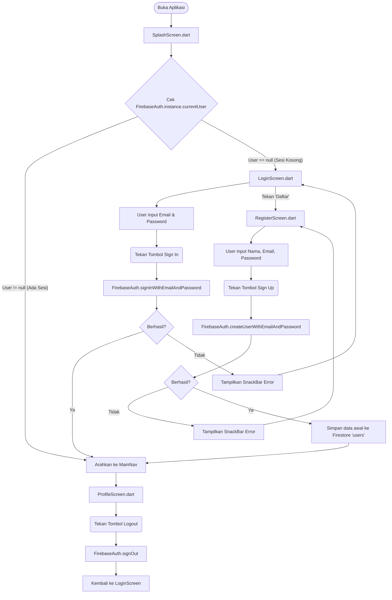
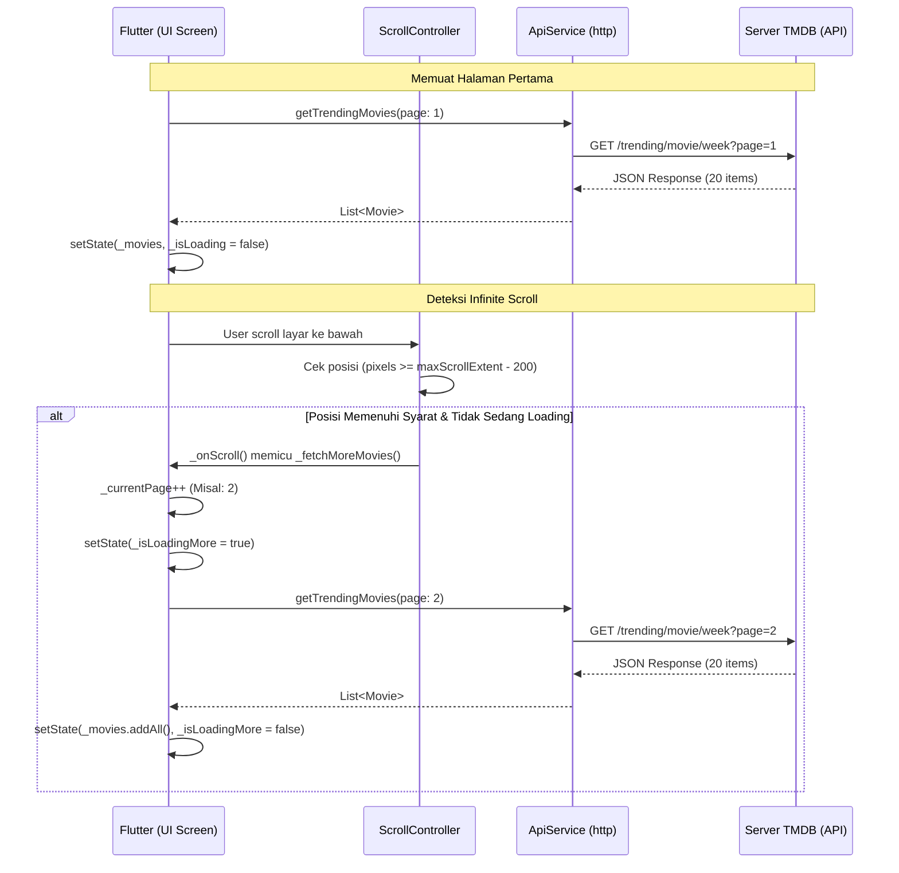
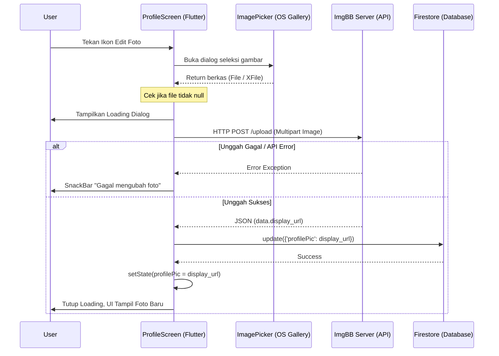

# Dokumentasi Flowchart dan Alur Kerja Sistem (My Movie List)

Dokumen ini berisi pemodelan visual dari alur kerja aplikasi **My Movie List** yang disusun berdasarkan implementasi nyata (source code) menggunakan sintaks **Mermaid**. Setiap diagram berfokus pada fitur utama aplikasi dan memperlihatkan bagaimana *client* (aplikasi Flutter) berinteraksi dengan layanan eksternal (Firebase, TMDB API, dan ImgBB API).

---

## 1. Flowchart Autentikasi (Login, Register, dan Cek Sesi)

Alur ini mencakup bagaimana aplikasi memeriksa sesi pengguna saat baru dibuka (Splash Screen), serta proses pendaftaran (Register) dan masuk (Login).



**Penjelasan Alur:**
- **Tujuan:** Memastikan hanya pengguna terverifikasi yang dapat mengakses aplikasi utama.
- **Implementasi Source Code:** Di `splash_screen.dart`, delay 3 detik dilakukan sebelum mengecek `currentUser`. Register mengirimkan data Auth dan sekaligus membuat dokumen kosong di Firestore (`_db.collection('users').doc(uid).set()`) sebagai penampung data profil kelak. Logout memanggil `FirebaseAuth.instance.signOut()` dan mereset tumpukan navigasi kembali ke `LoginScreen`.

---

## 2. Alur Interaksi Klien & API Eksternal (Pagination)

Alur ini menggambarkan bagaimana aplikasi memuat daftar film dari TMDB API, termasuk mekanisme *Infinite Scroll* yang ada pada halaman Trending, Upcoming, Search, dan Genre.



**Penjelasan Alur:**
- **Tujuan:** Mengelola pergerakan data bervolume besar secara bertahap tanpa membekukan layar (UI).
- **Implementasi Source Code:** Setiap layar daftar film (`trending_screen.dart`, `search_screen.dart`, dll) diikat dengan `ScrollController.addListener(_onScroll)`. Jika sisa jarak *scroll* kurang dari 200 piksel, fungsi mengirim HTTP GET via `ApiService` dengan parameter `&page=` yang ditambahkan dinamis. `json.decode` dipakai untuk mengubah data ke model `Movie`.

---

## 3. Flowchart Interaksi Film (Wishlist & Watched)

Alur ketika pengguna menambahkan suatu film ke daftar *Wishlist* atau *Watched* melalui halaman `DetailScreen`. Aplikasi menggunakan skema Firestore NoSQL.

```mermaid
flowchart TD
    A([Buka DetailScreen]) --> B[Cek Status di Firestore]
    B --> C{Dokumen dengan 'movieId' ada di sub-koleksi?}
    C -- Ada --> D[Tampilkan Ikon Checked]
    C -- Tidak Ada --> E[Tampilkan Ikon Plus (+)]
    
    E -- User menekan tombol --> F(Jalankan toggleWishlist / toggleWatched)
    D -- User menekan tombol --> F
    
    F --> G{Status saat ini?}
    G -- true (Sudah disimpan) --> H[FirebaseFirestore: delete()]
    H --> I[Hapus dokumen dari sub-koleksi]
    
    G -- false (Belum disimpan) --> J[FirebaseFirestore: set()]
    J --> K[Buat dokumen di sub-koleksi dengan timestamp]
    
    I --> L[Update UI Lokal setState]
    K --> L
```

**Penjelasan Alur:**
- **Tujuan:** Menyimpan data referensi film (*bookmark*) pengguna ke database cloud secara instan (*optimistic update*).
- **Implementasi Source Code:** Dikelola oleh `FirebaseService`. UI memanggil fungsi `toggleWishlist` atau `toggleWatched`. Logika menggunakan rujukan koleksi: `users/{uid}/wishlist/{movieId}`. Data aktual yang disimpan hanya berupa waktu tekan (`timestamp`), bukan data JSON film penuh untuk menghemat kuota Firestore.

---

## 4. Flowchart Fitur Pembuatan Ulasan (Review)

Menggambarkan alur proses memberikan rating bintang dan ulasan teks yang diikat pada ID Film.

```mermaid
flowchart TD
    Start([User di DetailScreen]) --> CekWatched{Apakah film ini Watched?}
    
    CekWatched -- Tidak --> B(Sembunyikan Form Ulasan)
    CekWatched -- Ya --> C[Tampilkan Form Ulasan Bintang & Teks]
    
    C --> Input[User memilih jumlah Bintang 1-5 & Ketik Ulasan]
    Input --> BtnSubmit(Tekan 'Kirim Ulasan')
    
    BtnSubmit --> Validasi{Teks Ulasan Kosong?}
    Validasi -- Ya --> Err[SnackBar: Ulasan tidak boleh kosong]
    Validasi -- Tidak --> Loading[Tampilkan Loading Indicator]
    
    Loading --> ProcDB[FirebaseService: addReview]
    ProcDB --> WriteDB[(Firestore: movies/{movieId}/reviews)]
    WriteDB --> Success[Tampilkan SnackBar Sukses]
    Success --> ClearForm[Kosongkan Form Input & Refresh Review List]
```

**Penjelasan Alur:**
- **Tujuan:** Mengumpulkan interaksi (*User Generated Content*) yang spesifik terikat pada satu entitas film (`movieId`).
- **Implementasi Source Code:** Di `detail_screen.dart`, form tidak dirender jika state `_isWatched` bernilai *false*. Data ditulis tidak di dalam *user document*, melainkan di-set menjadi koleksi global (`movies/{movieId}/reviews`) agar pengguna lain dapat melihat ulasan tersebut di kemudian hari.

---

## 5. Flowchart Pengubahan Foto Profil (Integrasi ImgBB)

Alur manajemen file lokal yang diubah menjadi URL yang dikelola publik agar Firestore hanya menyimpan URI string demi efisiensi.



**Penjelasan Alur:**
- **Tujuan:** Menghindari beban penyimpanan *binary/Blob* pada database. Mengkonversi gambar menjadi link (*URL*).
- **Implementasi Source Code:** Di `imgbb_service.dart`, request diolah bergantung platform (jika Web menggunakan `.readAsBytes()`, jika Mobile menggunakan `.fromPath()`). String URL yang didapat kemudian disimpan ke Firestore koleksi `users/{uid}` field `profilePic` lewat `FirebaseService.updateProfilePic()`.

---

## 6. Flowchart Logika Sinkronisasi Data Halaman 'My List'

Alur pembacaan data campuran antara *State* Firebase dan detail dari TMDB API.

```mermaid
flowchart TD
    Start([Buka MyListScreen]) --> StreamDB[StreamBuilder: Dengarkan Firestore 'users/{uid}/wishlist']
    
    StreamDB --> DataCek{Data Firestore berubah/diterima?}
    DataCek -- Ya --> Extract[Ekstrak List 'movieId']
    
    Extract --> Loop[Loop setiap 'movieId' pada List]
    Loop --> APIReq[Panggil TMDB API: getMovieDetails(movieId)]
    APIReq --> Gather[Kumpulkan hasil JSON API ke dalam List]
    
    Gather --> UIRender[Render GridView Poster Film]
```

**Penjelasan Alur:**
- **Tujuan:** Mempertahankan kebaruan data tanpa perlu menyimpan seluruh entitas JSON TMDB di dalam Firestore.
- **Implementasi Source Code:** Di `my_list_screen.dart`, fungsi `_fetchMoviesDetails()` menerima kembalian asinkron dari Stream Firestore. Aplikasi menggunakan `Future.wait()` (atau perulangan *for*) pada `ApiService.getMovieDetails()` untuk merekonstruksi data film utuh sebelum di-*render* ke UI menggunakan `GridView.builder`.
