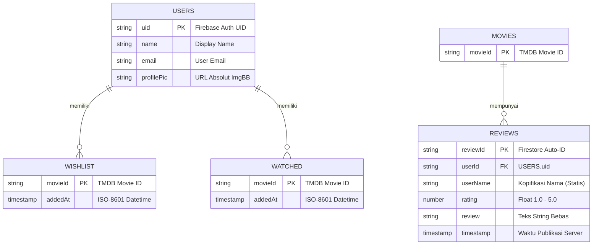
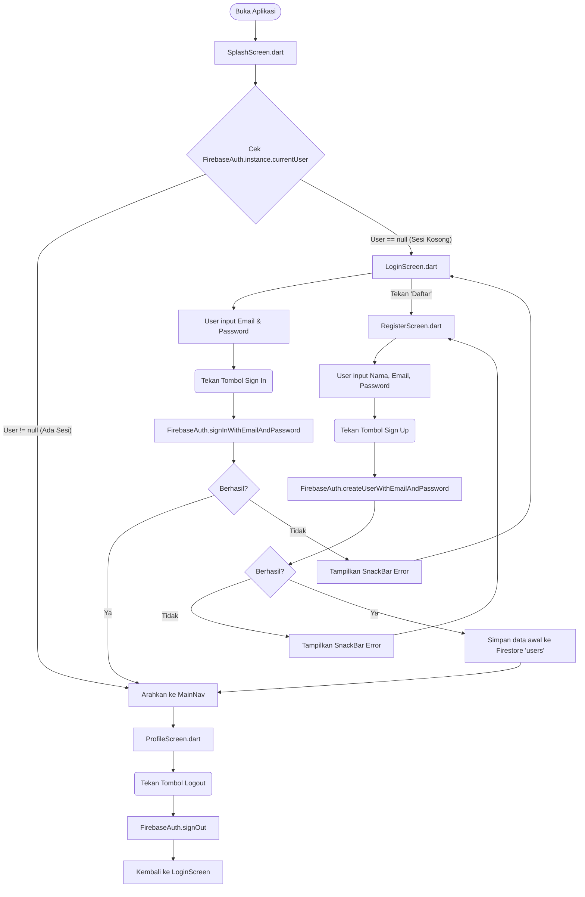
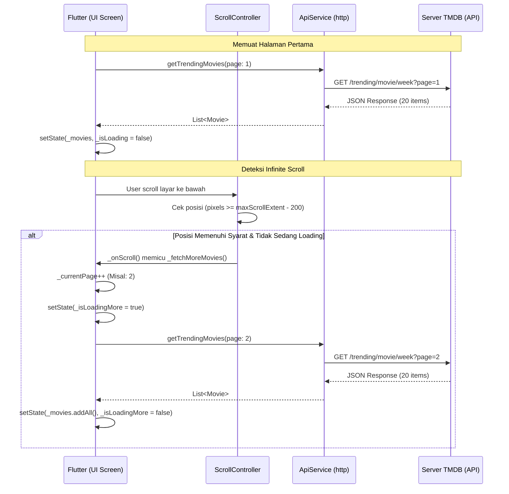
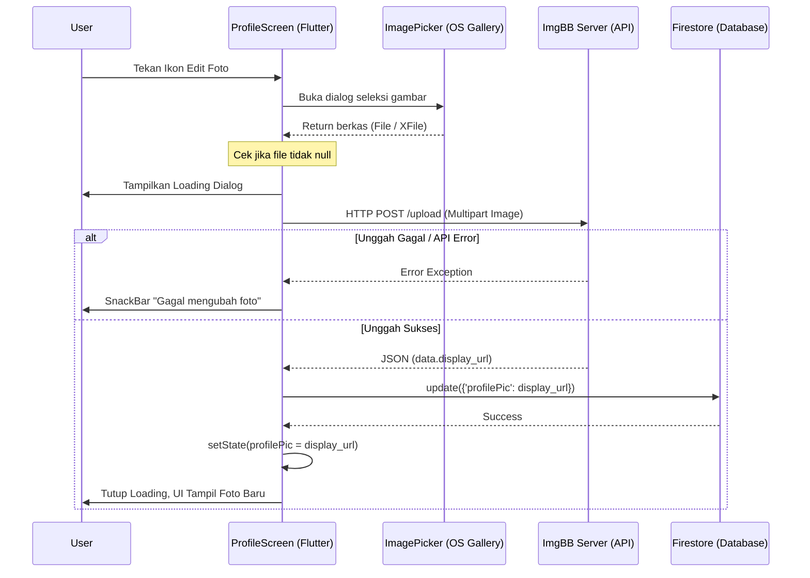

# Laporan Akhir Proyek Pemrograman Mobile: My Movie List

> **Mata Kuliah:** Pemrograman Mobile
> **Institusi:** Institut Teknologi Garut (ITG)
> **Dosen Pengampu:** [Nama Dosen Pengampu]
> **Tahun Akademik:** 2025/2026
>
> | No | Nama Lengkap | NIM |
> |---|---|---|
> | 1 | Kailla Salsabila | 2306064 |
> | 2 | Aghniya Alifatul Jannah | 2306035 |
>
> **Repositori Kode Sumber:** [github.com/aghniyaaj/my_movie_list](https://github.com/aghniyaaj/my_movie_list.git)

## 1. Pendahuluan

### 1.1 Latar Belakang Proyek
Di era digital saat ini, jumlah konten film yang diproduksi secara global terus meningkat pesat. Platform streaming seperti Netflix, Disney+, dan Amazon Prime merilis ratusan judul baru setiap bulannya. Hal ini menimbulkan permasalahan umum bagi penonton kasual maupun penggemar film: **kesulitan dalam melacak, mengingat, dan mengelola daftar tontonan secara terorganisir**.

Metode pencatatan konvensional seperti menggunakan aplikasi *Notes* bawaan perangkat memiliki beberapa kelemahan fundamental:
- Tidak memiliki metadata visual (poster, sinopsis, rating) sehingga sulit mengidentifikasi film hanya dari judul teks.
- Tidak tersinkronisasi ke *cloud*, sehingga data hilang jika perangkat di-*reset* atau diganti.
- Tidak mendukung interaksi sosial seperti pemberian ulasan yang dapat dilihat pengguna lain.
- Tidak terintegrasi dengan basis data film global yang selalu diperbarui (*real-time*).

Berdasarkan permasalahan tersebut, tim kami mengembangkan **My Movie List** — sebuah aplikasi *mobile* yang menggabungkan fungsionalitas penjelajahan katalog film global dengan sistem manajemen koleksi personal berbasis *cloud*.

### 1.2 Rumusan Masalah
Berdasarkan latar belakang di atas, rumusan masalah yang mendasari pengembangan aplikasi ini adalah:
1. Bagaimana merancang dan membangun aplikasi *mobile* yang mampu menampilkan data film secara *real-time* dari basis data global (TMDB)?
2. Bagaimana mengimplementasikan sistem autentikasi dan penyimpanan data personal berbasis *cloud* agar koleksi pengguna aman dan dapat diakses dari perangkat mana pun?
3. Bagaimana menyediakan fitur interaksi sosial berupa ulasan dan rating yang terhubung antar pengguna?
4. Bagaimana membangun arsitektur aplikasi yang efisien dalam penggunaan memori dan *bandwidth* jaringan?

### 1.3 Tujuan Proyek
Tujuan dari pengembangan aplikasi My Movie List adalah:
1. Mengembangkan aplikasi *mobile* lintas *platform* (Android/iOS) menggunakan *framework* Flutter yang mampu mengakses dan menampilkan ribuan data film dari TMDB API secara *real-time*.
2. Mengimplementasikan sistem autentikasi pengguna (registrasi, login, logout) menggunakan Firebase Authentication untuk menjamin keamanan akses.
3. Menyediakan fitur koleksi personal (*Wishlist* dan *Watched*) yang tersimpan di Firebase Cloud Firestore sehingga data pengguna persisten dan tersinkronisasi.
4. Membangun fitur ulasan dan rating komunitas yang memungkinkan pengguna berbagi opini terhadap film yang telah ditonton.
5. Mengimplementasikan manajemen profil pengguna lengkap dengan kemampuan mengunggah foto profil melalui integrasi API pihak ketiga (ImgBB).

### 1.4 Definisi Ruang Lingkup Proyek (Scope) *(Minggu 1)*
Berikut adalah 5 fitur inti beserta rincian sub-fiturnya yang ditetapkan sejak fase perencanaan awal:

**Fitur 1 — Autentikasi Pengguna:**
- Registrasi akun baru dengan input Nama Lengkap, Email, dan Password.
- Login dengan validasi kredensial Firebase Authentication.
- Manajemen sesi otomatis: pengguna yang sudah login tidak perlu memasukkan ulang kredensial saat membuka kembali aplikasi (*session persistence*).
- Logout yang menghapus sesi dan mengembalikan pengguna ke halaman login.

**Fitur 2 — Penjelajahan Katalog Film:**
- Dashboard utama (*Home Screen*) menampilkan tiga kategori film: Sedang Tren (*Trending*), Populer (*Popular*), dan Mendatang (*Upcoming*).
- Halaman pencarian (*Search Screen*) dengan kemampuan *full-text search* ke basis data TMDB.
- Penelusuran berbasis genre: pengguna dapat memilih kategori genre (Aksi, Komedi, Horror, dll.) dan melihat daftar film sesuai genre tersebut.
- Halaman detail film yang menampilkan poster, sinopsis, durasi, daftar genre, rating, daftar 10 aktor utama (*cast*), dan tombol putar *trailer* YouTube.
- Mekanisme *Infinite Scroll* (paginasi) pada seluruh halaman daftar film untuk mengelola ribuan data tanpa membekukan layar.

**Fitur 3 — Koleksi Personal (Wishlist & Watched):**
- Tombol aksi pada halaman detail film untuk menambahkan atau menghapus film dari daftar *Wishlist* (ingin ditonton) dan *Watched* (sudah ditonton).
- Halaman *My List* dengan dua tab terpisah menampilkan poster film yang telah ditandai pengguna.
- Data koleksi tersimpan di Firebase Cloud Firestore dan tersinkronisasi secara *real-time*.
- Validasi logis: film berstatus *Upcoming* (belum rilis) tidak dapat ditandai sebagai *Watched*.

**Fitur 4 — Ulasan & Rating:**
- Form ulasan yang hanya muncul jika film sudah ditandai sebagai *Watched* (mencegah ulasan *spam* dari pengguna yang belum menonton).
- Sistem rating bintang berskala 1-5.
- Validasi input: ulasan tidak boleh kosong.
- Daftar ulasan dari seluruh pengguna ditampilkan pada halaman detail film secara *real-time* menggunakan `StreamBuilder`.
- Halaman riwayat ulasan (*Review History*) yang menampilkan seluruh ulasan yang pernah ditulis oleh pengguna yang sedang login.

**Fitur 5 — Manajemen Profil:**
- Pengubahan nama pengguna (*display name*) yang tersinkronisasi ke Firebase Auth dan Firestore.
- Pengubahan password akun.
- Pengunggahan dan pengubahan foto profil melalui integrasi ImgBB API.
- Tampilan statistik personal: total film yang sudah ditonton (*Watched*) dan total ulasan yang telah ditulis.
- Navigasi cepat ke halaman *Wishlist* dan *Watched* dari layar profil.

### 1.5 Desain UI/UX — Mockup Figma *(Minggu 1)*
Sebelum memasuki fase implementasi kode, seluruh antarmuka aplikasi dirancang terlebih dahulu menggunakan **Figma** sebagai *tools* desain kolaboratif. Tujuan pembuatan *mockup* adalah:
- Memberikan panduan visual (*visual guide*) yang jelas bagi proses *slicing* UI ke dalam kode Flutter.
- Memastikan konsistensi elemen desain (warna, tipografi, tata letak) di seluruh halaman.
- Mempercepat proses pengembangan karena pengembang tidak perlu membuat keputusan desain secara *ad-hoc* saat *coding*.

Palet warna utama yang ditetapkan pada tahap desain:
- **Latar Belakang Utama:** `#0F141E` (Biru-abu gelap / *Dark Navy*) — memberikan kesan sinematik.
- **Warna Aksen Primer:** `#D32F2F` (Merah bata / *Crimson Red*) — digunakan pada tombol aksi, tab aktif, dan elemen interaktif.
- **Warna Kartu:** `#1F2633` (Abu gelap) — digunakan pada latar belakang komponen kartu dan navigasi.
- **Warna Teks Sekunder:** `#A0AAB2` (Abu terang) — digunakan pada label, keterangan, dan teks non-primer.

Berikut adalah *mockup* desain Figma untuk setiap halaman utama aplikasi:

**[Screenshot Mockup Figma — Splash Screen & Halaman Autentikasi (Login & Register)]**
> *Sisipkan tangkapan layar desain Figma di sini.*

**[Screenshot Mockup Figma — Home Screen (Dashboard Utama)]**
> *Sisipkan tangkapan layar desain Figma di sini.*

**[Screenshot Mockup Figma — Search Screen & Genre Movies Screen]**
> *Sisipkan tangkapan layar desain Figma di sini.*

**[Screenshot Mockup Figma — Detail Film (Atas: Info Film, Bawah: Ulasan)]**
> *Sisipkan tangkapan layar desain Figma di sini.*

**[Screenshot Mockup Figma — My List Screen (Wishlist & Watched)]**
> *Sisipkan tangkapan layar desain Figma di sini.*

**[Screenshot Mockup Figma — Profile Screen]**
> *Sisipkan tangkapan layar desain Figma di sini.*

### 1.6 Lingkungan Teknologi (Tech Stack) *(Minggu 1)*
Pemilihan teknologi didasarkan pada kebutuhan efisiensi pengembangan, ketersediaan dokumentasi, dan kompatibilitas *multi-platform*. Berikut adalah rincian lengkap beserta justifikasi pemilihan setiap komponen:

| Komponen | Teknologi | Versi | Justifikasi Pemilihan |
|---|---|---|---|
| **Bahasa Pemrograman** | Dart | SDK ^3.11.0 | Bahasa resmi Flutter dengan dukungan *null-safety*, kompilasi AOT (*Ahead-of-Time*) untuk performa native, dan *hot reload* untuk percepatan pengembangan. |
| **Framework UI** | Flutter | Stabil terbaru | Framework *multi-platform* dari Google yang mampu merender UI pada 60 FPS. Satu *codebase* dapat menghasilkan aplikasi Android dan iOS secara simultan. |
| **Autentikasi** | Firebase Authentication | ^6.5.2 | Layanan autentikasi *serverless* dari Google yang mendukung berbagai metode login. Pada proyek ini digunakan metode Email & Password. Terintegrasi langsung dengan Firestore. |
| **Database** | Firebase Cloud Firestore | ^6.5.0 | Database NoSQL berbasis dokumen yang mendukung *real-time listener* (`StreamBuilder`), operasi CRUD, dan sinkronisasi otomatis antar perangkat tanpa membangun server sendiri. |
| **Sumber Data Film** | TMDB API v3 | REST API | Basis data film terbesar dan terlengkap di dunia dengan lebih dari 900.000 entri film. Menyediakan metadata lengkap: poster, sinopsis multibahasa, rating, video trailer, dan data aktor. Gratis untuk penggunaan non-komersial. |
| **Penyimpanan Gambar** | ImgBB API | REST API | Layanan *hosting* gambar pihak ketiga yang menerima upload via *multipart/form-data* dan mengembalikan URL publik. Dipilih sebagai alternatif ringan dari Firebase Storage untuk menghemat kuota *bandwidth cloud*. |
| **HTTP Client** | Paket `http` | ^1.6.0 | Pustaka HTTP ringan untuk mengirim *GET* dan *POST request* ke API eksternal (TMDB & ImgBB). |
| **Akses Galeri** | Paket `image_picker` | ^1.2.2 | Pustaka untuk mengakses kamera atau galeri sistem operasi perangkat guna mengambil file gambar. Digunakan pada fitur pengubahan foto profil. |
| **Peluncur URL** | Paket `url_launcher` | ^6.3.2 | Pustaka untuk membuka URL eksternal (trailer YouTube) melalui *intent* sistem operasi. Diperlukan konfigurasi khusus `<queries>` pada `AndroidManifest.xml` untuk kepatuhan kebijakan *Package Visibility* Android 11+. |

### 1.7 Target Platform dan Versi Minimum
- **Platform Utama:** Android (target pengujian utama).
- **Platform Sekunder:** iOS (didukung secara arsitektural oleh Flutter, namun pengujian difokuskan pada Android).
- **Versi SDK Minimum:** Dart SDK ^3.11.0.
- **Versi Android Minimum:** Android 5.0 (API Level 21) — sesuai konfigurasi default Flutter.
- **Kompatibilitas Khusus:** Telah diuji dan dioptimasi untuk Android 11+ (API 30) yang menerapkan kebijakan *Package Visibility* ketat terhadap peluncuran URL eksternal.

### 1.8 Pembagian Tugas Anggota Kelompok

| Anggota | Peran & Tanggung Jawab Utama |
|---|---|
| **Kailla Salsabila** (2306064) | Perancangan UI/UX (Figma), implementasi halaman frontend (Splash, Login, Register, Home, Search, Detail), integrasi TMDB API, penyusunan laporan dan dokumentasi. |
| **Aghniya Alifatul Jannah** (2306035) | Perancangan struktur database Firestore, implementasi logika backend (Firebase Auth, Firestore CRUD, ImgBB upload), implementasi halaman My List, Profile, Review History, pengujian dan *debugging*. |

---

## 2. Arsitektur dan Struktur Proyek *(Minggu 1 & 2)*

### 2.1 Arsitektur Aplikasi (Monolithic Stateful)
Aplikasi dibangun menggunakan **Monolithic Stateful Architecture**. Pembaruan antarmuka (UI) dikendalikan murni melalui hierarki `StatefulWidget` dengan pengelolaan status lokal (`setState()`).
**Justifikasi Arsitektural:** Penggunaan *state management library* kompleks seperti BLoC, Riverpod, atau Provider sengaja dihindari untuk menjaga kesederhanaan (*simplicity*) ruang lingkup proyek 1 bulan. Aliran data (*data flow*) menggunakan pola *prop-drilling*, di mana fungsi *callback* dilempar dari komponen induk (contoh: `MainNav`) ke komponen anak (contoh: `HomeScreen` dan `ProfileScreen`) untuk memicu pembaruan lintas halaman.

### 2.2 Struktur Direktori Lanjutan (`/lib`)
Struktur folder menerapkan prinsip *Separation of Concerns* (Pemisahan Tanggung Jawab) antara lapisan presentasi, model data, dan layanan eksternal:
```text
lib/
├── core/             
│   └── constants.dart       # Penyimpanan terpusat kredensial API (TMDB & ImgBB) dan definisi HEX AppColors.
├── models/           
│   └── movie_model.dart     # Data class (POJO/POCO setara di Dart) pemetaan JSON ke properti tipikal.
├── screens/          
│   ├── auth/         
│   │   ├── login_screen.dart    # Autentikasi masuk dengan FirebaseAuth.signInWithEmailAndPassword.
│   │   └── register_screen.dart # Pendaftaran dengan FirebaseAuth.createUserWithEmailAndPassword.
│   ├── detail_screen.dart       # Halaman kompleks dengan integrasi 3 stream data: TMDB API, Firestore Watched/Wishlist, Firestore Reviews.
│   ├── main_nav.dart            # Komponen root navigasi (BottomNavigationBar) pengontrol state global.
│   └── [10 file lainnya]        # Representasi 1-to-1 dengan halaman antarmuka.
├── services/         
│   ├── api_service.dart         # Lapisan abstraksi HTTP GET ke TMDB (Parsing JSON ke List<Movie>).
│   ├── firebase_service.dart    # Lapisan abstraksi interaksi Firestore (addReview, addToWishlist, dll).
│   └── imgbb_service.dart       # Lapisan abstraksi HTTP POST ke ImgBB (Multipart Request).
└── main.dart                    # Entry point, inisialisasi Firebase.initializeApp().
```

### 2.3 Setup Proyek & Version Control *(Minggu 2)*
Proyek diinisiasi dengan `flutter create my_movie_list` dan dikelola menggunakan **Git** secara tersentralisasi di GitHub.
- **URL Repositori:** [https://github.com/aghniyaaj/my_movie_list.git](https://github.com/aghniyaaj/my_movie_list.git)
- **Strategi Pencabangan:** Menggunakan pola *Trunk-Based Development* tunggal pada *branch* `main`. Seluruh *commit* didorong langsung ke *branch* utama karena tim berukuran kecil (2 orang) dan prioritas pada kecepatan iterasi (*rapid prototyping*).

### 2.4 Sistem Navigasi Aplikasi (Routing & State Retention) *(Minggu 2)*
Sistem navigasi tidak menggunakan *Named Routes* (`/home`, `/profile`), melainkan injeksi langsung via `MaterialPageRoute`.
1. **Navigasi Utama (`MainNav`):** Diimplementasikan menggunakan `BottomNavigationBar` dengan mekanisme pergantian *index* pada list `screens`. State setiap halaman (seperti posisi *scroll*) akan di-*reset* saat berpindah tab karena halaman di-render ulang.
2. **Navigasi Stack (`Navigator.push`):** Digunakan untuk membuka `DetailScreen` atau `SearchScreen`. Ini menumpuk *widget* baru di atas *stack* sehingga ketika pengguna menekan tombol kembali (*back*), state halaman sebelumnya dipertahankan secara memori (*memory retention*).
3. **Cross-Tab Navigation:** Terdapat logika kustom `_navigateToListFromProfile` pada `main_nav.dart` yang memungkinkan transisi state lintas tab (dari Profil langsung membuka tab *My List* pada indeks spesifik).

### 2.5 Integrasi Aset Visual dan Desain UI *(Minggu 2)*
Pengelolaan aset diatur secara ketat (*strict typed*) untuk menghindari kegagalan *render*:
- **Font & Ikon:** Mengandalkan *Material Design Icons* dan *Roboto font* bawaan Flutter untuk meminimalisasi ukuran *build* APK.
- **Gambar Statis:** Logo aplikasi diletakkan di `assets/images/logo.png` dan diregistrasikan pada blok `flutter > assets` di `pubspec.yaml`.
- **Tema Terpusat:** Tidak menggunakan `ThemeData` global di `main.dart`, melainkan *hardcoding* warna melalui `AppColors` di `constants.dart` (contoh: `AppColors.bgDark`, `AppColors.primaryRed`) secara eksplisit di setiap komponen *widget* untuk kontrol absolut atas *rendering* piksel.

---


## 3. Desain Struktur Data dan Basis Data *(Minggu 1 & 3)*

### 3.1 Skema Entity-Relationship (NoSQL Firestore)
Firestore dikonfigurasi menggunakan hierarki *Collection* dan *Sub-Collection* untuk meminimalisasi kedalaman *query* dan membatasi pembacaan dokumen (*document reads*).



### 3.2 Spesifikasi Teknis Entitas
1. **Pemisahan Referensial (`users/{uid}/wishlist`)**:
   Koleksi `wishlist` dan `watched` hanya menyimpan `movieId` (bertipe String) dan `addedAt` (bertipe Timestamp). **Payload film asli (poster, judul, sinopsis) TIDAK diduplikasi** ke Firestore. Aplikasi akan mengambil `movieId` dari Firestore, lalu melakukan iterasi HTTP GET ke TMDB API untuk mengambil data visual secara asinkron. Ini menjamin data film selalu *up-to-date* dan menghemat kuota Firestore.
2. **Koleksi Sosial (`movies/{movieId}/reviews`)**:
   Koleksi `movies` di Firestore bersifat maya (*virtual root*); dokumen induknya kosong, hanya digunakan sebagai jangkar (*anchor*) untuk sub-koleksi `reviews`. Hal ini adalah praktik terbaik Firestore untuk memecah data berskala besar.

### 3.3 Kontrak API Eksternal (API Contracts)
Aplikasi beroperasi sebagai *client* dari 2 layanan REST API:

**A. TMDB API v3 (`api.themoviedb.org/3`)**
Setiap respons JSON dipetakan secara ketat ke dalam *Data Model* `Movie` via `factory Movie.fromJson()`.
- `GET /trending/movie/week` & `GET /movie/popular`: 
  Memerlukan parameter `page`. JSON di-parsing pada array `results`. Properti krusial yang diekstrak: `id`, `title`, `overview`, `poster_path`, `backdrop_path`, `vote_average`.
- `GET /movie/{id}`:
  Digunakan untuk detail spesifik. Mengembalikan array `genres` (di-parsing menjadi string dipisahkan koma) dan `runtime` (dikonversi dari integer menit ke format "Xj Ym").
- **Mekanisme *Fallback* Bahasa:** Jika `GET /movie/{id}?language=id-ID` mengembalikan properti `overview == ""`, sistem secara otomatis menembak ulang `GET /movie/{id}?language=en-US` untuk mencegah layar kosong.

**B. ImgBB API (`api.imgbb.com/1`)**
- `POST /upload`: Mengirim *payload* `multipart/form-data` berisi `image` (berbasis `File` atau *Bytes*). Parsing membedah objek JSON bertingkat: `json['data']['display_url']` untuk mendapatkan tautan *hotlink* gambar.

### 3.4 Pemetaan Operasi CRUD Tingkat Lanjut *(Minggu 3)*
Eksekusi logika bisnis dipetakan ke fungsi spesifik di dalam direktori `services`:

| Entitas | Operasi | Pemanggilan Method / Fungsi Internal | Keterangan Teknis |
|---|---|---|---|
| **Users** | Create | `FirebaseAuth.createUserWithEmailAndPassword()` | Memicu inisialisasi `Firestore.collection('users').doc(uid).set()` berisi data default. |
| **Users** | Update | `FirebaseService.updateUserProfile()` | Melakukan eksekusi berantai (*chain*): Update Auth Profile + Update Firestore Document. |
| **Koleksi** | Create | `FirebaseService.addToWishlist()` | Menulis payload `{'addedAt': FieldValue.serverTimestamp()}` ke `users/{uid}/wishlist/{movieId}`. |
| **Koleksi** | Delete | `FirebaseService.removeFromWishlist()` | Mengeksekusi `.delete()` pada spesifik `DocumentReference` ID film. |
| **Koleksi** | Read | `StreamBuilder<QuerySnapshot>` | *Real-time listener* pada koleksi *Wishlist/Watched*. Memicu re-render otomatis jika data berubah dari *cloud*. |
| **Ulasan** | Create | `FirebaseService.addReview()` | Menginjeksi *payload* Map berisi UID, nama, teks, rating ke `movies/{movieId}/reviews`. |
| **Ulasan** | Read | `StreamBuilder` (OrderBy Timestamp DESC) | Menampilkan *feed* ulasan secara *real-time* diurutkan dari yang terbaru. |

### 3.5 Penanganan Error dan Validasi Input *(Minggu 3)*
Penanganan *exception* diimplementasikan secara granular, bukan sekadar `try-catch` umum:

1. **Intersepsi Error Firebase Auth:**
   Pesan error sistematis dari Firebase ditangkap berdasarkan kode pengecualian eksplisit (`e.code`):
   - `user-not-found` → Ditampilkan sebagai SnackBar: "Pengguna tidak ditemukan."
   - `wrong-password` → Ditampilkan sebagai SnackBar: "Password salah."
   - `email-already-in-use` → Saat pendaftaran diblokir dengan peringatan relevan.

2. **Validasi Klien (*Client-side Validation*):**
   - *Early Exit*: Fungsi *submit* form langsung memanggil `return` (membatalkan eksekusi API) apabila pengecekan `.isEmpty` pada `TextEditingController` bernilai *true*.
   - Mencegah input null pada rating bintang (di-set default ke 0.0 jika belum digeser).

3. **Penanganan Error I/O & Jaringan:**
   - Pemanggilan `http.get` TMDB API dibungkus *try-catch*. Jika gagal (*SocketException* karena jaringan mati), mengembalikan *List* kosong `[]` sehingga UI dapat menampilkan indikator "Tidak ada data" alih-alih menyebabkan *Fatal Crash*.
   - Widget gambar direkayasa (*engineered*) dengan pengaman `errorBuilder`. Jika koneksi terputus saat merender `Image.network`, Flutter tidak akan membuang *stack trace* merah, melainkan mengganti *frame* dengan `Icon(Icons.movie)`.

4. **Proteksi Memory Leak:**
   Penggunaan asinkronisasi `await` di dalam `StatefulWidget` selalu diikuti oleh `if (!mounted) return;` sebelum mengeksekusi `setState()`. Hal ini menjamin bahwa sistem tidak mencoba merender ulang halaman yang sudah dihancurkan (*popped from stack*) oleh pengguna.

---


## 4. Alur Kerja Sistem dan Flowchart Logika *(Minggu 1 & 3)*

### 4.1 Flowchart Autentikasi (Login, Register, dan Cek Sesi)
Alur ini mencakup bagaimana aplikasi memeriksa sesi pengguna saat baru dibuka (Splash Screen), serta proses pendaftaran (Register) dan masuk (Login).


**Penjelasan Alur (Teknis):**
- **Siklus Evaluasi Sesi:** Di `splash_screen.dart`, aplikasi memanfaatkan `FirebaseAuth.instance.currentUser` pasca-delay 3 detik. Evaluasi sinkron ini menentukan percabangan *Routing*. Penggunaan `Navigator.pushReplacement` memastikan halaman *Splash* dihancurkan dari memori (*popped from stack*) sehingga pengguna tidak bisa menekan "Back" kembali ke layar logo.
- **Inisiasi Kredensial Paralel:** Pada `RegisterScreen`, metode `createUserWithEmailAndPassword()` tidak bekerja sendirian. Jika `UserCredential` valid, sistem segera menembakkan operasi paralel: `Firestore.collection('users').doc(uid).set()`. Ini memastikan setiap akun Auth *cloud* memiliki proksi basis data NoSQL sebagai wadah properti tambahan (seperti foto profil).
- **Terminasi Sesi:** Saat `FirebaseAuth.instance.signOut()` dieksekusi di `ProfileScreen`, antarmuka langsung dipaksa me-reset tumpukan rute secara absolut menuju `LoginScreen`.

### 4.2 Alur Interaksi Klien & API Eksternal (Pagination)
Alur ini menggambarkan bagaimana aplikasi memuat daftar film dari TMDB API, termasuk mekanisme *Infinite Scroll* yang ada pada halaman Trending, Upcoming, Search, dan Genre.


**Penjelasan Alur (Teknis):**
- **Logika *Infinite Scroll*:** Layar tidak mengambil 1000 film sekaligus (mencegah *Out of Memory*). Daftar diikat ke `ScrollController.addListener(_onScroll)`. Algoritma mendeteksi jika pergerakan proksimitas piksel pengguna mencapai ambang batas bawah: `if (_scrollController.position.pixels >= _scrollController.position.maxScrollExtent - 200)`.
- **Mekanisme Penguncian (*State Locking*):** Untuk mencegah penembakan API bertubi-tubi saat di-scroll cepat, *state* boolean `_isLoadingMore` disetel ke *true*. Request API baru hanya diizinkan jika *lock* ini bernilai *false*.
- **Injeksi Data Dinamis:** Hasil dari `getTrendingMovies(page: 2)` tidak menimpa data lama. Melainkan, data JSON yang telah di-parsing ke `List<Movie>` disuntikkan ke dalam state yang sudah ada menggunakan mutator `_movies.addAll(newMovies)`, disusul pemanggilan `setState()` parsial.

### 4.3 Flowchart Interaksi Film (Wishlist & Watched)
Alur ketika pengguna menambahkan suatu film ke daftar *Wishlist* atau *Watched* melalui halaman `DetailScreen`.

```mermaid
flowchart TD
    A([Buka DetailScreen]) --> B[Cek Status di Firestore]
    B --> C{Dokumen dengan 'movieId' ada di sub-koleksi?}
    C -- Ada --> D[Tampilkan Ikon Checked]
    C -- Tidak Ada --> E[Tampilkan Ikon Plus (+)]
    
    E -- User menekan tombol --> F(Jalankan toggleWishlist / toggleWatched)
    D -- User menekan tombol --> F
    
    F --> G{Status saat ini?}
    G -- true (Sudah disimpan) --> H[FirebaseFirestore: delete()]
    H --> I[Hapus dokumen dari sub-koleksi]
    
    G -- false (Belum disimpan) --> J[FirebaseFirestore: set()]
    J --> K[Buat dokumen di sub-koleksi dengan timestamp]
    
    I --> L[Update UI Lokal setState]
    K --> L
```
**Penjelasan Alur (Teknis):**
- **Resolusi Referensial Instan:** Saat pengguna membuka `DetailScreen`, UI tidak mengambil seluruh dokumen *Wishlist*, melainkan langsung mengecek presensi ID film tersebut: `Firestore.collection('users').doc(uid).collection('wishlist').doc(movieId).get()`.
- ***Optimistic UI Rendering*:** Saat tombol "+ Wishlist" ditekan, *state* `_isWishlist` langsung ditukar (`!_isWishlist`) via `setState()` tanpa menunggu balikan dari server Firebase. Ini mematikan *latency* secara visual (*zero delay feedback*).
- **Injeksi *Timestamp*:** Alih-alih membuat `DateTime.now()` dari jam HP pengguna (yang bisa dimanipulasi), aplikasi mengirimkan instruksi `FieldValue.serverTimestamp()`. Ini memaksa server Google yang menentukan waktu pastinya, menjamin konsistensi penyortiran global.

### 4.4 Flowchart Fitur Pembuatan Ulasan (Review)
Menggambarkan alur proses memberikan rating bintang dan ulasan teks yang diikat pada ID Film.

```mermaid
flowchart TD
    Start([User di DetailScreen]) --> CekWatched{Apakah film ini Watched?}
    
    CekWatched -- Tidak --> B(Sembunyikan Form Ulasan)
    CekWatched -- Ya --> C[Tampilkan Form Ulasan Bintang & Teks]
    
    C --> Input[User memilih jumlah Bintang 1-5 & Ketik Ulasan]
    Input --> BtnSubmit(Tekan 'Kirim Ulasan')
    
    BtnSubmit --> Validasi{Teks Ulasan Kosong?}
    Validasi -- Ya --> Err[SnackBar: Ulasan tidak boleh kosong]
    Validasi -- Tidak --> Loading[Tampilkan Loading Indicator]
    
    Loading --> ProcDB[FirebaseService: addReview]
    ProcDB --> WriteDB[(Firestore: movies/{movieId}/reviews)]
    WriteDB --> Success[Tampilkan SnackBar Sukses]
    Success --> ClearForm[Kosongkan Form Input & Refresh Review List]
```
**Penjelasan Alur (Teknis):**
- **Interlock Visibilitas (Gatekeeping):** Form ulasan di `DetailScreen` secara dinamis disembunyikan `Visibility(visible: _isWatched)`. Jika `_isWatched` bernilai *false* (film belum pernah ditonton), form ulasan dieliminasi dari *Widget Tree*. Ini menghemat memori (*rendering cost*) dan mencegah ulasan fiktif (*spam validation*).
- **Intersepsi Kekosongan Validasi:** Sebelum `FirebaseService.addReview` dipanggil, `TextEditingController.text.trim().isEmpty` bertindak sebagai *early return*. Jika terpicu, `ScaffoldMessenger` menyuntikkan *SnackBar* pesan kesalahan ke hierarki *context* terdekat.
- **Relasional Maya:** Ulasan di-push menggunakan `collection.add()` yang menghasilkan `reviewId` autogenerasi secara alfanumerik panjang di bawah rujukan `movies/{movieId}/reviews`. Aplikasi tidak memperbarui dokumen induk filmnya sama sekali.

### 4.5 Diagram Pengubahan Foto Profil (Integrasi ImgBB)
Alur manajemen file lokal yang diubah menjadi URL publik.


**Penjelasan Alur (Teknis):**
- **Abstraksi Berkas Lintas Platform:** `ImagePicker().pickImage()` mengembalikan objek `XFile` yang merepresentasikan aset OS lokal. Alih-alih mengkonversinya menjadi tipe `File` (yang mana akan merusak kompatibilitas Web), aplikasi langsung membaca *byte array* dengan `readAsBytes()`.
- **Eksekusi *Multipart-Request*:** `ImgbbService` membungkus *bytes* ini ke dalam format `http.MultipartRequest`, merakit *header POST*, dan menyuntikkan `api_key` rahasia ImgBB.
- **Sinkronisasi Pasca-Unggah:** Begitu respons HTTP `200 OK` mereturn payload `data.display_url`, `FirebaseService.updateProfilePic()` segera melakukan *patching* (mengganti nilai Field spesifik) pada dokumen `users/{uid}` via `FirebaseFirestore.instance.doc().update()`. UI lalu merender ulang `CircleAvatar(backgroundImage: NetworkImage(url))`.

### 4.6 Flowchart Sinkronisasi Data 'My List'
Alur pembacaan data campuran antara *State* Firebase dan TMDB API.

```mermaid
flowchart TD
    Start([Buka MyListScreen]) --> StreamDB[StreamBuilder: Dengarkan Firestore 'users/{uid}/wishlist']
    
    StreamDB --> DataCek{Data Firestore berubah/diterima?}
    DataCek -- Ya --> Extract[Ekstrak List 'movieId']
    
    Extract --> Loop[Loop setiap 'movieId' pada List]
    Loop --> APIReq[Panggil TMDB API: getMovieDetails(movieId)]
    APIReq --> Gather[Kumpulkan hasil JSON API ke List]
    
    Gather --> UIRender[Render GridView Poster Film]
```
**Penjelasan Alur (Teknis):**
- **Data Piping (Cloud ke API):** Fitur ini adalah perwujudan eksekusi data hibrida (Firebase + TMDB). `StreamBuilder` memantau `QuerySnapshot` dari koleksi Firestore secara kontinu. 
- **Paralelisasi Asinkron (Future.wait):** Karena dokumen *Wishlist* (misal berisi 10 ID film) hanya berupa *string*, aplikasi harus memanggil 10 kali HTTP GET ke TMDB untuk mendapatkan posternya. Daripada memanggilnya satu-satu secara berurutan (Sangat lambat, `O(N)` waktu latensi jaringan), aplikasi memetakan iterasi tersebut ke dalam sebuah array *Promises/Futures*, lalu mengeksekusinya secara absolut simultan via sintaks `await Future.wait(movies.map((id) => api.getMovieDetails(id)))`. Ini mereduksi waktu beban (loading time) dari 10x latensi menjadi hanya 1x latensi terpanjang (*O(1) Network Delay*).

---

## 5. Dokumentasi Terperinci Berdasarkan Halaman (UI/UX) *(Minggu 2)*

> **Catatan:** Desain awal seluruh halaman berikut dirancang terlebih dahulu menggunakan Figma (lihat Sub-bab 1.3), kemudian diimplementasikan ke dalam kode Flutter (*Slicing UI*).

### 5.1 Splash Screen
- **Fungsi Instansiasi:** Bertindak sebagai *buffer* visual dan eksekutor logika awal sistem (*Bootstraping*).
- **Komposisi Widget:** Menggunakan `Image.asset` berdimensi 300x300 dengan proteksi lapis dua via `errorBuilder`. Jika memori gagal memuat *asset* gambar lokal, sistem tidak akan melempar *red screen of death*, melainkan merender `Icon(Icons.movie)` sebagai cadangan mutlak (*fallback*).
- **Proteksi Siklus Hidup (Lifecycle):** Di dalam fungsi inisiasi asinkron `Future.delayed(3 seconds)`, terdapat injeksi pengaman `if (!mounted) return;`. Ini adalah praktik rekayasa kritis; jika pengguna seketika menutup/meminimalkan aplikasi saat logo masih berputar, Flutter tidak akan mencoba mendorong `Navigator.pushReplacement` ke *context* yang sudah mati (*preventing memory leak crash*).
- **[Screenshot Halaman Splash]**
  > *Menampilkan sebuah logo bundar bertema film dengan tulisan My Movie List di tengah layar berlatar belakang biru-abu gelap (0xFF0F141E).*

### 5.2 Modul Autentikasi (Login & Register Screen)
- **Manajemen Form (*Form State*):** Seluruh `TextFormField` dibungkus dalam *widget* `Form` yang dikendalikan melalui `GlobalKey<FormState>`. Sebelum API Firebase Auth dipanggil, fungsi `_formKey.currentState!.validate()` dieksekusi sebagai gerbang logika (*logic gate*) penangkal input kosong/invalid, menghemat pemanggilan jaringan yang tidak perlu.
- **Enkripsi Visibilitas UI:** Field *password* menggunakan properti `obscureText: true` untuk menyembunyikan input karakter, memastikan keamanan visual di tempat umum (*shoulder surfing protection*).
- **Injeksi Basis Data (*Database Seeding*):** Pada `RegisterScreen`, eksekusi tidak berhenti pada pembuatan kredensial. Fungsi `.then((userCredential))` merantai eksekusi asinkron kedua ke Firestore, melakukan *push* dokumen JSON berisi `uid`, `name`, `email`, dan `profilePic` (kosong) menggunakan metode `.set()`. Ini mempersiapkan struktur relasional untuk fitur lain.
- **[Screenshot Halaman Login]**
  > *Menampilkan form input Email dan Password, tombol Sign In berwarna merah bata, serta teks link menuju halaman pendaftaran di bawah.*
- **[Screenshot Halaman Register]**
  > *Menampilkan form input Nama Lengkap, Email, dan Password (dengan obscureText aktif), serta tombol Sign Up.*

### 5.3 Home Screen (Dashboard Utama)
- **Evaluasi *ConnectionState*:** Render UI sangat bergantung pada siklus `FutureBuilder`. Saat `snapshot.connectionState == ConnectionState.waiting`, UI menahan *render tree* utama dan merotasi `CircularProgressIndicator`. Barulah ketika *state* berpindah ke `.done` dan `snapshot.hasData`, grid film sesungguhnya dilepas ke layar.
- **Manipulasi Gradien Bayangan (*ShaderMask*):** Pada *Banner Carousel* Trending, poster film beresolusi tinggi di-*crop* membulat (menggunakan `ClipRRect`), lalu ditimpa dengan *widget* `ShaderMask`. Ini menciptakan ilusi gradasi gelap di bagian bawah poster (`LinearGradient` hitam ke transparan), memastikan teks judul film di atasnya tetap terbaca (*WCAG contrast compliant*) tanpa merusak estetika poster asli.
- **Perutean Orientasi Render:** Menggunakan `ListView.builder` dengan parameter `scrollDirection: Axis.horizontal` untuk menyajikan puluhan *node* poster tanpa melanggar batas lebar (*viewport overflow*).
- **[Screenshot Dashboard/Home]**
  > *Menampilkan slider banner di bagian atas (sedang tren), deretan daftar populer horizontal, deretan rilis mendatang, serta tombol-tombol bulat untuk kategori genre (Aksi, Petualangan, dsb).*

### 5.4 Fitur Ekosistem Film (Search & Genre Movies)
- **Pemicu Eksekusi (*Execution Trigger*):** Halaman tidak melakukan pergerakan data (*fetching*) setiap kali pengguna mengetik satu huruf (untuk mencegah pembengkakan *request* API). Input hanya dievaluasi ketika *event* `onSubmitted` ditembakkan (pengguna menekan Enter/Search di *keyboard*), memicu `searchMovies(query)`.
- **Polimorfisme UI:** Halaman ini memiliki logika *render* ganda. Pengamatan (*listener*) diletakkan pada nilai *text controller*. Jika input `isEmpty`, antarmuka merender *Grid Wrap* tombol kategori genre statis. Begitu input terisi dan di-submit, keseluruhan *Grid* dihancurkan dan diganti (*hot-swapped*) dengan `ListView` hasil pencarian dinamis dari TMDB.
- **[Screenshot Halaman Pencarian]**
  > *Menampilkan AppBar berupa kotak pencarian. Bagian badan menampilkan grid "Jelajahi Genre" apabila belum mencari, atau daftar list memanjang ke bawah berisikan poster film kecil, tahun rilis, dan tombol bintang rating apabila sedang mencari.*

### 5.5 Halaman Detail Film (Krusial & Terkompleks)
- **Sinkronisasi Status Ganda (*Dual-State Sync*):** Halaman ini mengelola dua variabel *state* krusial: `_isWatched` dan `_isWishlist`. Tombol UI dimanipulasi dengan logika *Optimistic UI*; menekan tombol seketika mengganti warna/ikon (umpan balik 0 detik) sebelum paket asinkron benar-benar menyentuh *server* Firestore.
- **Intersepsi *Intent* Sistem (Trailer Youtube):** Karena pembaruan kebijakan keamanan *Package Visibility* Android 11 (API Level 30+), paket `url_launcher` tidak bisa sembarangan menembak URL. Sistem direkayasa dengan menambahkan tag `<queries>` untuk skema `http` dan `https` di `AndroidManifest.xml` agar OS Android mengizinkan pelemparan *Intent* aplikasi TMDB menuju aplikasi YouTube perangkat tanpa diblokir oleh *sandbox* sekuritas.
- **Format Rendering Data:** Atribut `voteAverage` (misal dari API: `7.892`) di-cast menjadi string presisi satu desimal menggunakan `.toStringAsFixed(1)` (`7.9`) agar desain grid tidak pecah.
- **[Screenshot Halaman Detail (Atas)]**
  > *Menampilkan poster film besar menutupi separuh atas layar, disusul judul tebal, tahun, durasi, tag genre, serta 2 tombol aksi ("+ Watched" dan "+ Wishlist") berdampingan.*
- **[Screenshot Halaman Detail (Bawah - Review Area)]**
  > *Menampilkan gambar thumbnail YouTube, jejeran foto bundar aktor pemeran utama (Cast), serta kotak input teks beserta pemilihan 5 ikon bintang dan tombol 'Kirim Ulasan'.*

### 5.6 Halaman Koleksi Saya (My List Screen)
- **Manajemen Tabular View:** Menggunakan *widget* `DefaultTabController` untuk mengatur memori (RAM) dua *sub-page* (Wishlist & Watched) secara efisien tanpa harus merakit *state controller* kustom. 
- ***Data Piping* & Dekomposisi UI:** Halaman ini sangat rawan memberatkan performa (*jank*). Oleh karena itu, beban merender grid poster (yang menembak TMDB API berulang kali) tidak disatukan di file ini, melainkan dipisah (*decoupled*) ke dalam *widget* modular bernama `MovieGridBuilder`. `MyListScreen` hanya bertugas mendengarkan *Stream* dari Firestore, lalu mengoper array ID ke `MovieGridBuilder` untuk ditangani secara independen.
- **[Screenshot Halaman My List]**
  > *Menampilkan tulisan "Daftar Saya", dengan 2 tab ("Wishlist" & "Watched"). Isi halamannya berupa deretan poster film vertikal berbentuk grid padat.*

### 5.7 Manajemen Akun (Profile Screen)
- **Penanganan Aset Biner Cerdas:** Saat eksekusi `ImagePicker`, aset foto tidak diterjemahkan sebagai `File` lokal yang lambat diproses, melainkan disedot langsung sebagai *byte array* di memori RAM via `readAsBytes()`. Hal ini memungkinkan fungsi *upload* beroperasi sangat cepat dan menjamin portabilitas kode jika proyek kelak dikompilasi ke Flutter Web.
- **Integrasi *TextEditingController* Lanjut:** Fitur "Ubah Nama" mem- *bind* (*binding*) `TextEditingController` ke *state* `FirebaseAuth.instance.currentUser?.displayName`. Saat metode `.updateDisplayName()` ditembakkan, antarmuka `ProfileScreen` dan komponen ulasan (*Review Stream*) secara retroaktif menangkap perubahan ini, mensinkronkan ulang nama pengguna lama dengan nama yang baru diubah secara instan tanpa perlu memuat ulang aplikasi.
  1. Pengguna menekan tombol pena di atas foto (Edit Foto).
  2. `ImagePicker` dipanggil dan sistem operasi host menyajikan dialog kamera/galeri.
  3. Setelah pengguna memilih berkas `.jpg`/`.png`, berkas lokal diumpankan ke fungsi upload `ImgbbService`.
  4. URL final dari respons HTTP ImgBB dipotong, dan `FirebaseService` memanggil `doc(uid).update({'profilePic': finalUrl})`. UI di-`setState` ulang.
- **[Screenshot Halaman Profil]**
  > *Menampilkan foto profil bundar beserta ikon kamera, nama dan email, disusul kotak hijau/merah bertuliskan statistik "Total Watched" dan "Total Ulasan", lalu isian form "Ubah Nama" dan "Ganti Password", serta ditutup tombol merah "Logout" di bawah.*

---

## 6. Prosedur Instalasi, Pembangunan (Build), dan Deployment *(Minggu 4)*

Proyek ini memerlukan sistem operasi pendukung untuk kompilasi kode native (Android Studio/Xcode).

### 6.1 Persiapan Lingkungan Pembangunan
1. **Instalasi Flutter SDK & Toolchain:** Pasang Flutter 3.11+ dan lakukan verifikasi lintas-platform (*toolchain verification*) via terminal:
   ```bash
   flutter doctor -v
   ```
   Pastikan kompiler *Android SDK Build-Tools*, *Java JDK*, dan *Gradle* terdeteksi tanpa ada peringatan *fatal error* di sektor *Android toolchain*.

### 6.2 Tahapan Mode Pengembangan (Development)
1. Lakukan *Clone* (Salin) repositori dari *remote server* Git ke penyimpanan lokal.
2. Unduh dan tautkan (*linking*) paket dependensi eksternal dari *pub.dev*:
   ```bash
   flutter pub get
   ```
3. Melakukan *Quality Control* statis (*Static Code Analysis*) untuk memastikan tidak ada pemborosan memori atau variabel tak terpakai:
   ```bash
   flutter analyze
   ```
   *(Aplikasi ini telah melalui proses refaktorisasi hingga bebas error dan warning, 0 issues tersisa).*
4. Eksekusi JIT (*Just-In-Time*): Inisiasi kompilasi panas (*hot-reloadable*) ke *emulator* atau fisik perangkat melalui USB *Debugging*:
   ```bash
   flutter run
   ```

### 6.3 Kompilasi Sistem Produksi (APK Android Build)
Penciptaan *binary executable* untuk rilis publik dilakukan dengan arsitektur kompilasi *Ahead-of-Time* (AOT). Ini menghancurkan mesin virtual Dart (JIT) dari dalam APK, membuat aplikasi berjalan *native* dan jauh lebih cepat secara *framerate*.

```bash
flutter build apk --release
```

- **Mekanisme *Tree-Shaking* & *R8 Shrinking*:** Saat mode `--release` dipicu, kompiler Flutter akan melakukan *Tree-Shaking* (membuang kode/library yang tidak dipanggil sama sekali) dan mengeksekusi mesin *R8 Android* untuk mengecilkan (*obfuscate* dan *shrink*) kelas Java/Kotlin.
- Proses kompilasi awal menginstruksikan Gradle untuk merakit kerangka kerja Android, memadukan *assets*, dan mengepak (*packaging*) *bytecode* ke ekstensi `.apk` terkompresi DEX.
- Titik henti (output) aplikasi diletakkan oleh Gradle pada *path*:
  `build/app/outputs/flutter-apk/app-release.apk`
- Berkas tunggal `app-release.apk` inilah yang merupakan *deliverable* final siap didistribusikan ke *end-user*.

---

## 7. Skenario Pengujian Kualitas (UAT Checklist) *(Minggu 4)*

Daftar cek (*User Acceptance Testing*) berikut membuktikan bahwa fungsionalitas utama aplikasi telah diuji dan berjalan sebagaimana mestinya tanpa ada kendala (bug).

| Modul / Halaman | Skenario Pengujian (Aksi) | Hasil (Teknis) yang Diharapkan | Status |
|---|---|---|---|
| **Autentikasi** | Register akun dengan email & password valid | `createUser` mereturn obyek kredensial, dokumen JSON profil dibuat via `.set()`, navigasi *pushReplacement* ke UI Dashboard. | ✅ Lulus |
| **Autentikasi** | Intersepsi Login dengan password salah | OS menangkap `FirebaseAuthException` dan menyuntikkannya ke *UI thread* sebagai *SnackBar* peringatan merah. | ✅ Lulus |
| **Dashboard** | Memaksa ambang batas *Scroll* 200px dari bawah | Fungsi `_onScroll` dipicu otomatis, `_isLoadingMore` mengunci state, mengirim HTTP GET `page=N+1` ke TMDB. | ✅ Lulus |
| **Pencarian** | Input teks *query* (misal: "Batman") | *Event* `onSubmitted` menghancurkan grid statis genre, melakukan *hot-swap* dengan *ListView builder* berisi respon JSON TMDB. | ✅ Lulus |
| **Detail Film** | Menembak aksi "Trailer YouTube" | Paket `url_launcher` melewati restriksi keamanan OS Android 11+ via kueri Manifest dan merender UI webview/eksternal. | ✅ Lulus |
| **Detail Film** | Membuka API tanpa lokalisasi `id-ID` | Protokol *Fallback* terpicu mereturn blok teks dari respon `en-US` secara mandiri. | ✅ Lulus |
| **Koleksi Saya** | Sinkronisasi UI Optimistis | *State* boolean terbalik seketika; dokumen Timestamp ditulis ke subsistem cloud `users/{uid}/wishlist` asinkron. | ✅ Lulus |
| **Koleksi Saya** | Membaca tabulasi *My List* | `StreamBuilder` memutar *Futures Array*, mereturn deretan poster film lintas-*platform* API & Cloud Database. | ✅ Lulus |
| **Ulasan** | Injeksi form ulasan dan rating ganda | Operasi tulis sukses, *stream listener* di sisi UI menangkap mutasi koleksi `reviews` dan menata ulang urutan komentar DESC. | ✅ Lulus |
| **Profil User** | Konversi Aset `ImagePicker` | File binari disedot memori RAM, di-*post* ke ImgBB. URL respon disimpan ke rujukan pengguna (Sinkronisasi *Retroactive* bekerja pada ulasan lama). | ✅ Lulus |
| **Profil User** | Transisi State Ganda Profil | Modifikasi nama via `.updateDisplayName()` memantik pembaharuan ganda layar UI & data komentar turunan *real-time*. | ✅ Lulus |
| **Film Mendatang** | Inisiasi komparasi *Date-Time* | `DateTime.now()` mengevaluasi `releaseDate` TMDB. Atribut *Watched* dihancurkan sementara/terkunci mati untuk film masa depan. | ✅ Lulus |

### 7.2 Dokumentasi Bug Fixing *(Minggu 4)*
Berikut adalah daftar *bug* yang ditemukan selama fase pengujian internal beserta solusi perbaikannya:

| No | Bug yang Ditemukan | Penyebab | Solusi yang Diterapkan |
|---|---|---|---|
| 1 | Trailer YouTube gagal dibuka di Android 11+ | Kebijakan *Package Visibility* Android 11 (API 30) memblokir *intent* URL eksternal yang tidak dideklarasikan secara eksplisit. | Menambahkan tag `<queries>` dengan skema `http` dan `https` pada file `AndroidManifest.xml`. |
| 2 | Nama pengguna pada komentar lama tidak berubah setelah profil diperbarui | Data ulasan di Firestore bersifat statis (*snapshot*); tidak ada mekanisme relasi dinamis di NoSQL. | Mengimplementasikan algoritma **Retroactive Sync** di sisi UI: sistem mendeteksi UID pemilik komentar, jika cocok dengan akun yang sedang login, foto dan nama otomatis diambil dari `FirebaseAuth.currentUser` secara *real-time*. |
| 3 | Foto profil pada komentar tidak sinkron setelah diganti | Alasan sama dengan bug nomor 2. | Ditangani oleh solusi Retroactive Sync yang sama. |
| 4 | Film berstatus "Mendatang" dapat ditandai sebagai Watched | Tidak ada validasi tanggal rilis pada tombol Watched. | Menambahkan *getter* `_isUpcoming` yang membandingkan `releaseDate` dengan `DateTime.now()`, serta parameter `isUpcomingMovie` pada *constructor* `DetailScreen` untuk memastikan film dari tab Mendatang selalu terkunci. |
| 5 | Sinopsis kosong pada film berbahasa non-Indonesia | TMDB API tidak selalu menyediakan terjemahan sinopsis bahasa Indonesia untuk semua film. | Mengimplementasikan **Data Fallback Protocol**: jika `overview` bahasa Indonesia kosong, sistem otomatis memanggil endpoint kedua dengan parameter `language=en-US`. |

### 7.3 Penyusunan Dokumentasi & Deliverable *(Minggu 4)*
Sebagai bagian dari fase *finishing*, berikut adalah dokumen pendukung yang telah disusun:
1. **Laporan Akhir Proyek** (dokumen ini) — mencakup seluruh rincian teknis dari Minggu 1 hingga Minggu 4.
2. **Naskah Presentasi** — script dialog untuk 2 orang presenter yang menjelaskan setiap bab laporan.
3. **File APK Release** — hasil kompilasi `flutter build apk --release` yang siap diinstal di perangkat Android.
4. **Repositori GitHub** — seluruh *source code* beserta riwayat *commit*.

---

## 8. Analisis dan Kesimpulan Teknis *(Minggu 4)*

### 8.1 Evaluasi Kelebihan Sistem (Pros)
- **Toleransi Kegagalan Data (Data Fallback Protocol):** Program dirancang antisipatif (*defensive programming*). Contoh nyatanya adalah sistem perbaikan kecacatan TMDB API pada data sinopsis berbahasa Indonesia. Aplikasi mampu melakukan pengikatan data dari API bahasa Inggris sebagai pengganti otomatis apabila data terjemahan kosong, menghindari rusaknya layout (layar kosongan).
- **Kepatuhan Keamanan OS Modern:** Aplikasi mengadopsi standar keamanan intent *Android 11+ (API 30)* dengan secara eksplisit mendefinisikan tag `<queries>` untuk skema `http/https` pada `AndroidManifest.xml`. Ini menjamin peluncuran URL eksternal (Trailer YouTube) dapat tereksekusi mulus tanpa diblokir oleh protokol privasi sistem operasi.
- **Efisiensi Manajemen Memori (Infinite Scroll):** Penerapan struktur parameter `&page=` yang dinamis dalam *API Service* serta sinkronisasi `ScrollController` menjauhkan aplikasi dari risiko kehabisan memori atau kelebihan muatan *CPU load*.
- **Integritas Penulisan Kode:** Tidak ada residu paket yang memboroskan APK (penghapusan `device_preview` dari kompilasi produksi), dan semua pencatatan konsol (`print`) telah dienkapsulasi menggunakan standar pelepasan memori Flutter (`debugPrint`).

### 8.2 Analisis Kekurangan Arsitektur Saat Ini (Cons)
- **Bottleneck Eksekusi Pemanggilan API pada List:** Halaman *My List Screen* yang sangat ekstensif memanggil struktur interogasi siklus *for-loop* API independen terhadap `getMovieDetails` untuk masing-masing item ID di Firebase. Jika pengguna menaruh 500 film di *Wishlist*, aplikasi akan membebani TMDB API dengan 500 koneksi get sekaligus, berpotensi memicu *Rate Limit Block* jaringan atau *Timeout*.
- **Struktur Manajemen State Terikat GUI:** Logika komunikasi dengan *FirebaseService* masih diimpor dan diinstansiasi secara manual (`setState`) pada UI Screen (*DetailScreen, ProfileScreen*). Ini bertentangan dengan kaidah *Clean Architecture* dan membuat proyek rentan bila fungsionalitas membesar.

### 8.3 Saran Pengembangan Berkelanjutan
1. **Pengadopsian Pustaka Pengaturan *State* Global:** Refaktor arsitektur dari *StatefulWidget* murni ke paradigma BLoC (*Business Logic Component*) atau Riverpod. Ini akan memisahkan UI sepenuhnya dari pengambil keputusan data (*Data Layer*).
2. **Sistem Singgahan Luring (*Offline Caching Layer*):** Memasukkan librari `Hive` atau `SQflite` untuk menyimpan data detail JSON sementara. Ini meniadakan pembaharuan muatan pada halaman *My List* ketika berstatus tiada internet, serta menyelamatkan kuota akses TMDB API.
3. **Sentralisasi Penyimpanan Aset Pribadi:** Integrasi fitur pengunggahan foto profil ke **Firebase Storage** (arsitektur asli Google), ketimbang menitipkan aset berharga pengguna pada server API eksternal tak berbayar yang tak terkontrol dan memiliki batasan tingkat transfer lalu lintas akses (ImgBB).
